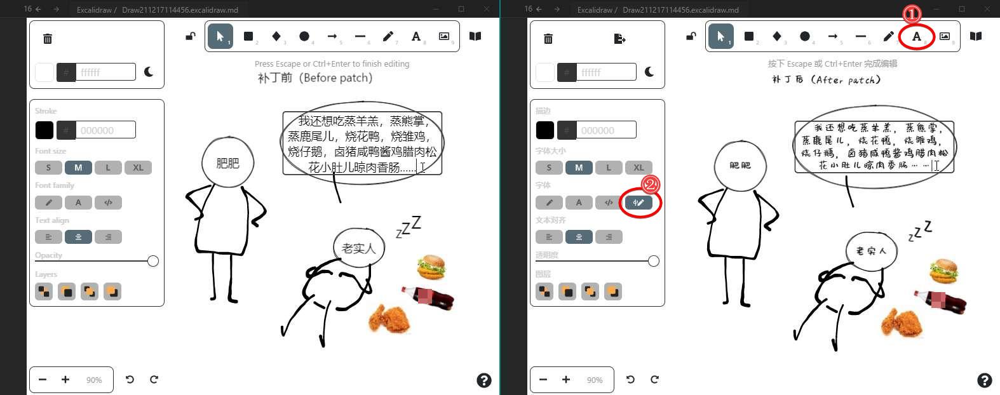

# DEPRECATED

~~⚠️ This repo is just a workaround. Once a full solution comes out (we are working on it, see this [issue](https://github.com/zsviczian/obsidian-excalidraw-plugin/issues/14#issuecomment-1008651870) and  [PR](https://github.com/zsviczian/excalidraw/pull/55), this repo would be deprecated.~~

⚠️Thanks to the fast response and hard working of [@zsviczian](https://github.com/zsviczian), the feature of setting local fonts for obsidian-excalidraw-plugin has come out from [release 1.5.17](https://github.com/zsviczian/obsidian-excalidraw-plugin/releases/tag/1.5.17). So I'm happy to announce that **this repository is deprecated**.

---

#  Background

The [obsidian-excalidraw-plugin](https://github.com/zsviczian/obsidian-excalidraw-plugin) integrates [Excalidraw](https://excalidraw.com), a feature rich sketching tool, into Obsidian. However, in lack of related APIs from Excalidraw, it is difficult for users to customize the Text Tool's font family to a local font in sketching. As a result, some non-ASCII charactors (e.g., Chinese charactors) is displayed in system default font family style, not fitting the style of the integrated ASCII handwriting fonts.

Although there is not a perfect solution yet, the owner of obsidian-excalidraw-plugin [@zsviczian](https://github.com/zsviczian) is working on this problem and has put forward a [semi-solution](https://github.com/zsviczian/obsidian-excalidraw-plugin/issues/14#issuecomment-979460183); And the purpose of this tool, Excalipatch, is to provide another workaround as a second choice. In breif, Excalipatch embeds a user-specific local font into `main.js`, the source code of obsidian-excalidraw-plugin, and adds a new Text button to use the font.

Here are the key features of Excalipatch:

* Add a new Text Tool button with a user-specific local font into Obsidian-excalidraw-plugin
* Change the language of sketching UI

# Install

Excalipatch is a portable tiny tool on Windows OS (at least XP) and doesn't need to install. Just download the lastest version of `excalipatch.exe` from [Releases](https://github.com/tswwe/excalipatch/releases) page.

Though before using it, you must have the lateset Obsidian (version 0.12.16+) and Obsidian-excalidraw-plugin (version 1.5.15+) installed. A local font file is also needed (The font used in the demo is called "Muyao-Softbrush").

# Usage

## Attention

Before playing with Excalipatch, you must keep in mind that:

* This is NOT permanent. Every time Obsidian-excalidraw-plugin updates, the `main.js` will be restored and need to be patched again.
* This is NOT robust. Excalipatch hacks the code of `main.js` by identifying its patterns. Thus, if the code makes big changes, Excalipatch may fail on recognizing.
* Excalipatch only supports Windows OS currently, though the patched `main.js` file may be cross-platform.

## Step by step

1. Close Obsidian.

2. Put `excalipatch.exe` and your local font file (ttf/otf/woff/woff2 format is supported) together with `main.js` (usually located in `YourValut\.obsidian\plugins\obsidian-excalidraw-plugin\`).

3. Double-click to run `excalipatch.exe` and pray for getting the patched file `main.js.patched`. If you don't get the patched file, turn to [Troubleshooting](#Troubleshooting).

   > You can also run `excalipatch.exe` by command line, which supports more arguments. For example, `excalipatch.exe lang="zh-CN" button="button name" font="xxx.ttf" icon="yyy.svg"`. Each argument is optional.

4. Backup the origin `main.js`, then replace it with the patched file.

5. Open Obsidian. If Obsidian fails to load Obsidian-excalidraw-plugin, or the plugin doesn't work properly, that means the patched file is broken. Please close Obsidian IMMEDIATELY and restore the backup `main.js`. After that, turn to [Troubleshooting](#Troubleshooting).

   > If you don't have a backup, you can also update or reinstall Obsidian-excalidraw-plugin.

## Troubleshooting

If Excalipatch reports an error message while running, or the patched file is broken, please check at first:

* Whether the version of Obsidian-excalidraw-plugin is newer than 1.5.15? Excalipatch doesn't support too old versions of Obsidian-excalidraw-plugin.
* Whether you are using the latest version of Excalipatch?

In other cases, please [open an issue](https://github.com/tswwe/excalipatch/issues) and describe the problem. Don't forget to provide following informations:

* error message
* the versions of your Windows OS, Obsidian, Obsidian-excalidraw-plugin and Excalipatch
* other information towards the problem, e.g., the `manifest.json` file in your Obsidian-excalidraw-plugin folder

# Contributing

* Any suggestions? Please [open an issue](https://github.com/tswwe/excalipatch/issues).
* Want to contribute to the code? Please fork and clone this repo, and work on the `project` folder which contains all the source code written in [aardio](https://ide.update.aardio.com/releases/aardio.7z). Feel free to submit PRs.
