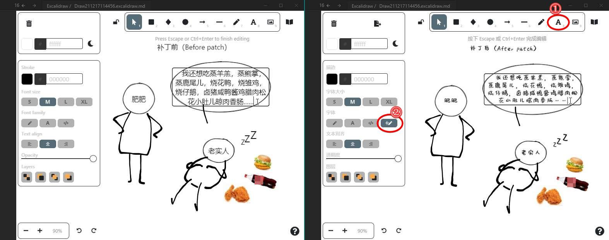

⚠️ 本仓库只是一个临时的应对方案。等到较完善的方案完成（正在尝试中…见该 [Issue](https://github.com/zsviczian/obsidian-excalidraw-plugin/issues/14#issuecomment-1008651870) 和 [PR](https://github.com/zsviczian/excalidraw/pull/55)），本仓库将废弃。

---

# 背景

[Obsidian-excalidraw-plugin](https://github.com/zsviczian/obsidian-excalidraw-plugin)是一个将功能强大的绘图工具 [Excalidraw](https://excalidraw.com) 引入 Obsidian 的插件。但由于 Excalidraw 尚未支持相关功能，用户在绘图中使用文本工具时，无法将文本的字体修改为本地字体。这导致插件只能调用系统默认字体来显示非ASCII字符，与内置的英文手写字体风格不搭。

这个问题目前还没有完美的解决方案，Obsidian-excalidraw-plugin 插件的作者（[@zsviczian](https://github.com/zsviczian)）正在努力解决这个问题，并已经提出了一种[过渡方案](https://github.com/zsviczian/obsidian-excalidraw-plugin/issues/14#issuecomment-979460183)；本工具（Excalipatch）则尝试提供另一种备选方案，大概思路是：将用户的本地字体文件嵌入 Obsidian-excalidraw-plugin 的源代码（`main.js`）中，并添加一个文本按钮来使用这个字体。

Excalipatch 的主要功能：

* 在 Obsidian-excalidraw-plugin 中添加一个新的文本工具按钮，该按钮使用用户指定的本地字体文件
* 修改绘图界面的语言

# 安装方法

Excalipatch 是一个绿色小程序，不需安装，只要到[发行版页面](https://github.com/tswwe/excalipatch/releases)下载最新版本的 `excalipatch.exe` 即可。

当然，在使用前你需要先安装最新版本的 Obsidian（0.12.16+） 和 Obsidian-excalidraw-plugin（1.5.15+）。此外，还需要自己准备一个字体文件（上图示例中所用字体是“沐瑶软笔手写体”）。

# 使用说明

## 注意事项

使用 Excalipatch之前，你需要清楚以下几点：

* 这
* 该方案不具有持久性。每次 Obsidian-excalidraw-plugin 升级都会导致 `main.js` 被还原，需要重新应用一次补丁。
* 该方案不保证可靠性。Excalipatch 通过识别 `main.js` 中的某些特征来对其进行修补，一旦源代码发生较大改动，可能会导致修补失败。
* Excalipatch 目前只能在 Windows 系统中使用，尽管生成的 `main.js` 可能是跨平台的。

## 使用步骤

1. 退出 Obsidian。

2. 把 `excalipatch.exe` 和字体文件（支持 ttf/otf/woff/woff2 格式）放在 `main.js` （通常位于 `你的仓库\.obsidian\plugins\obsidian-excalidraw-plugin\`）同一目录下。

3. 双击运行 `excalipatch.exe`，顺利的话即可得到修补后的 `main.js.patched` 文件。如果无法得到修补文件，请转至[疑难排解](#疑难排解)。

   > 也可以通过命令行运行 Excalipatch，支持更多参数，例如：`excalipatch.exe lang="zh-CN" button="按钮名称" font="xxx.ttf" icon="yyy.svg"`。每个参数都是可选的。

4. 备份原来的 `main.js`，再将修补后的 `main.js.patched` 重命名为 `main.js`。

5. 重启 Obsidian。如果 Obsidian 无法加载 Obsidian-excalidraw-plugin 插件，或者 Obsidian-excalidraw-plugin 插件无法正常使用，说明补丁失效，请**立刻**退出 Obsidian 并还原备份的 `main.js`。然后，请转至[疑难排解](#疑难排解)。

   > 如果你没有备份，也可以直接升级或重装 Obsidian-excalidraw-plugin 。

## 疑难排解

如果 Excalipatch 在运行过程中报错，或者生成的补丁文件失效，请首先自查：

* 你的 Obsidian-excalidraw-plugin 是否为 1.5.15 或更新？Excalipatch 不支持太古老的版本。
* 你使用的 Excalipatch 是否为最新版？

其余情况下，请[提 issue](https://github.com/tswwe/excalipatch/issues) 并描述问题。记得提供以下信息：

* 错误提示
* 操作系统版本，Obsidian 版本，Obsidian-excalidraw-plugin 版本，Excalipatch 版本
* 其他有助于描述问题的信息，例如 Obsidian-excalidraw-plugin 目录下的 `manifest.json`  文件

# 如何贡献

* 对项目的建议，请[提 Issue](https://github.com/tswwe/excalipatch/issues)。
* 如果你想参与代码的开发，请 fork 并克隆本仓库到本地，仓库中的 `project` 目录包含了项目所有的工程文件（是用 [aardio](https://ide.update.aardio.com/releases/aardio.7z) 编写的）。修改完成后，欢迎提 PR。

